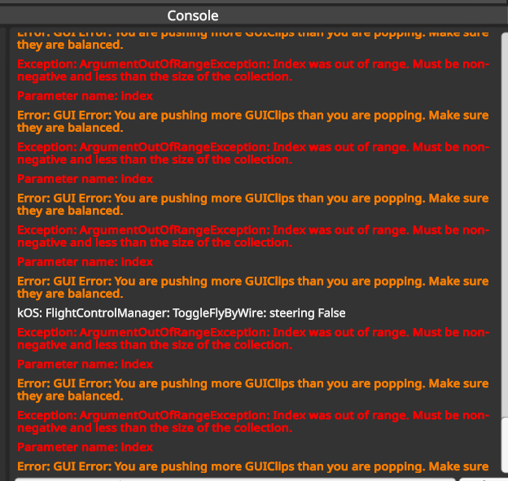

## Ideas

Okay, here is my idea for what the FMS/IFC would look like. I want this to be a decent central control for both terrestrial flights and spaceplane flights into LEO. Some of my ideas:

I could create my own flight plans, i.e.:
It would have an add leg button? (idk, leg or phase or something), but I would be able to choose from:
- Takeoff
- Navigate to (either to nav markers, waypoints, or to arbitrary coordinates) (for terrestrial flight - no orbital stuff necessary)
- Spaceplane suborbital trajectory insertion program
    - say we're starting at 15000 ft and engage this program, we would specify a desired apoapsis and perhaps some other parameters, and it would most efficiently use the spaceplane to get us out of the atmosphere
- Spaceplane re-entry program
    - say we're starting at a 75000 ft orbit, given some desired waypoint, or nav marker, I want it to fire engines retrograde, then begin a re-entry program that keeps the spaceplane in a stable attitude, and uses its pitch to control its lift and drag (like the shuttle did)
- Approach (we've made this)
- Land (we also have this)

I want to be able to save flight plans, load flight plans, and edit them, delete, or swap them.

Now, there's a few things I'm not sure about, like:
- whether climb and descent are phases, or if that's just a transitional state that is entered when say you're going from Takeoff to Cruise. I'm open to your thoughts here.

Other thoughts:
- It would be good to be able to edit things like V-speeds (Vr, V2, speed during climb, etc.)
- Ability to take manual control of the aircraft with a button without exiting the full program.

Closing thoughts:
- I've ideated a lot. I'm not sure what would be the most robust and intuitive way to integrate all of this. I'd like you to reflect on my ideas, as well as give me ideas, suggestions, criticisms, etc.

---

- have maximum manuevering speed as a parameter

- have spoilers modulate their deflection according to both current aerodynamic pressure (don't want to break apart the ac), and also difference between current and desired speed maybe?
- have autobrakes that modulate their braking percentage according to something?

## Bugs to Fix

- Honestly.. I think we need to revert to before the performance improvements commit - that broke a lot and we never really recovered. I do not understand how the program functions. 

- moderate g seems to get deactivated randomly? possibly when switching from kOS director to cruise flight controller

aircraft doesn't bank during approach?
autothrottle rate still weirdly slow? ~1hz

## 23-03-2026
Okay. Just did another test flight of the pattern - log 54.csv

- Do not use AA native speed control ever, for any phase of flight. Use native autothrottle module always.

- At T10:32 - why is it using FPA 0 to hold altitude - it should just keep using altitude hold mode

- when the localizer is intercepted the aircraft is 130m to the right - why is this, given that the waypoint it is following should be the 30km rwy 27 beacon, which should be on the localizer

- why when the localizer is intercepted, the aircraft is in waypoint mode aiming for the ils beacon? that will not get the aircraft onto the localizer fast enough - honestly, just put the aircraft into kOS director mode once the localizer becomes alive 

- while tracking glideslope and localizer, the following is flashing on screen, meaning that these are getting triggered in a loop somewhere:
kOS director enabled
Standard Fly-By-Wire Enabled
Standard Fly-By-Wire Disabled
kOS Director Enabled

This keeps getting spammed in the KSP debug log

---

- only skip fix if it is directly behind you in a 10 degree cone (implying it's actually behind you)

- add max gear ext speed (COMPLETE)

- add all of Van's runways to nav beacons. Make sensible approaches for all of them.

- organize the cfgs in a more intuitive way. group all vfe/max extension speeds, and have parameters grouped in the order of: preflight, takeoff, cruise, approach, landing.

Desired behaviour: every aircraft should have a default cruise speed that it defaults to for cruise phases.

I want the FMS terminal or GUI to show the current target (heading,alt, etc.) and the current actual value - that way I know what it's trying to do and if it's succeeding
